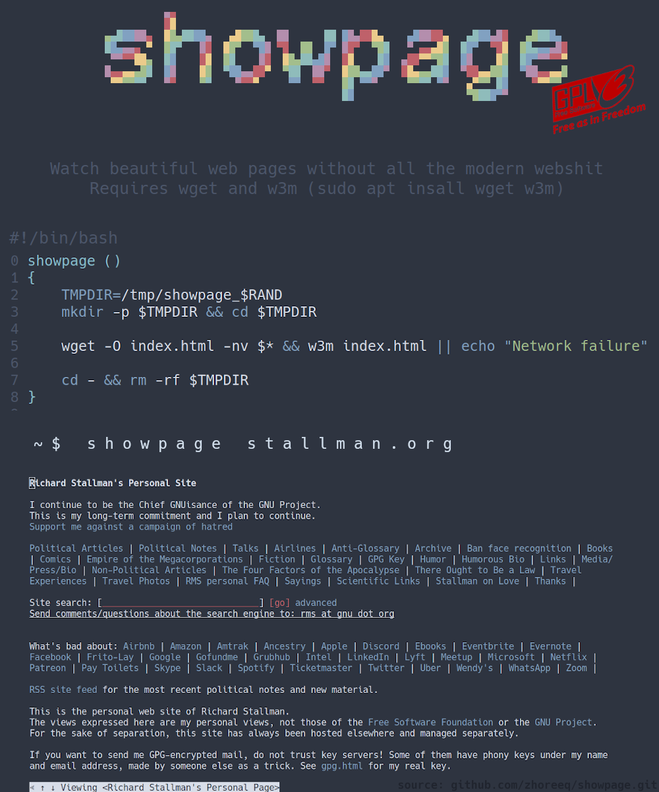

# showpage

Watch beautiful web pages without all the modern webshit.

## Requirements

`sudo apt insall wget w3m`

## Installation

Copy the `showpage` function definition to your ~/.bashrc file.

Alternatively, copy the whole script file to /usr/local/bin

## Usage

`showpage https://stallman.org`
